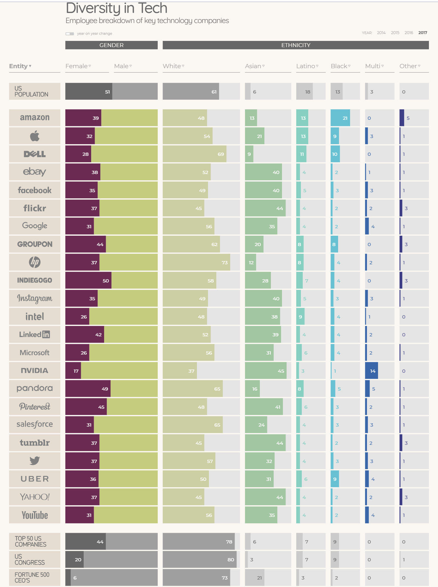

# Reading 301-14: Diversity and Inclusion in Tech

## When Women Stopped Coding
This article is aviailable [here](https://www.npr.org/sections/money/2014/10/21/357629765/when-women-stopped-coding).

The article begins with data: like in many professional fields, the percentage of women in the tech industry had been steadily inceasing since around 1970, until around 1985 the percentage began heading the other direction. 
The article finds that this correlated with the rise of personal computers, which at outset were mostly marketed to men. This meant that when the young men and women of the era had disparate experiences with computers when considering their career paths and education. The expectations in computer science education had changed, and therefore the sense of inclusion and opportunity had as well. 

## DataVisualization Employee Breakdown of Tech Companies

## Why Diversity Matters in Tech
This article is avialable [here](https://www.usatoday.com/story/tech/columnist/2015/07/21/why-diversity-matters-your-tech-company/30419871/).

This article provides analysis from a number of angles on the value of diverse teams in tech (and really everywhere else as well). There are several key points outlined:

- Diverse teams have better overall performance
- Diverse teams are better suited to serving a diverse range of customers
- Diverse teams benefit from better creativity and more effective collaboration

These all contribute to a clear conclusion: making diversity a priority has real payoffs for companies on all levels. 

[<<Return to Home](../README.md)