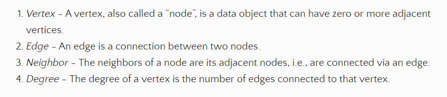

# Reading 401-35: Graphs

## CodeFellows Docs: Graphs
This article is available [here](https://codefellows.github.io/common_curriculum/data_structures_and_algorithms/Code_401/class-35/resources/graphs.html).

A graph is a data structure that is comprised of vertices and nodes. This article gives a list of definitions for terms related to graphs right at the start: 

### Directed or Undirected?

The nodes in a graph can have a particular direction in which they are linked that controls the natural flow of traversals in the graph. In an undirected graph, the edges either have multiple directions or no direction, giving no defined movement. 

In a directed graph, the nodes each have a pointer that specifies which node comes next. 

### Complete, Connected, and Disconnected

Graphs can have three statuses based on their connections: 

- Complete: Each node has connectionsto each other node. 
- Connected: Each node has at least one edge. 
- Disconnected: Some nodes lack an edge connection. 

A Cyclic graph has nodes and edges that form a loop, where an acyclic graph does not. Either of these can be directed or undirected, though. 

### Representing Graphs

A graph can be represented either through an adjacency matrix or an adjacency list. The matrix is comprised of a two-dimensional array that represents a matrix of the relationships between the vertices, with an affirmative value wherever connections shoudl be represented. 

More commonly, a graph can be represented with an adjacency list: a collection of linked lists that each contain the connections for a specific vetex. 

Graphs can be traversed as one would traverse a tree, but with some slight caveats. 

[<<Return to Home](../README.md)       