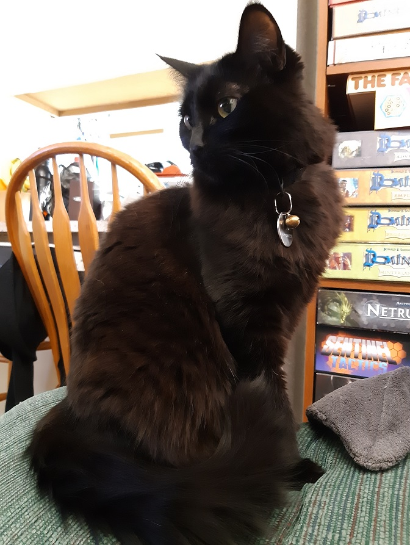

# Reading 201-7: Object-Oriented Programming, HTML Tables, Global Object Documentation

## Codefellows: Domain Modeling

This article, written by Ryan Sobol, Sam Hamm, and Keli Hansen, is available [here](https://github.com/codefellows/domain_modeling#domain-modeling)

The article covers using objects to model the solution to a problem domain, and using constructor functions to apply the object models to many different individual examples of the modeled problem. 

```javascript
var cat = function(age, color) {
this.age = age
this.color = color
}

var primrose = new cat(1, calico);
var yunalesca = new cat(6, black);
```
In this code block, the function "cat" initiates a type of object that can be created by calling the function with the appropriate parameters.

`cat.prototype.functionName = function(parameters){}`

can be used to add a method to the cat object type, which then lets us call that method in reference to any particular cat. Yunalesca doesn't have a method herself, but if we made one for the cat prototype then Yunalesca, being the clever cat that she is, could go find that method and run it anyhow. 
 


from there we have a plethora of options for manipulating the objects in conjunction with each other to create data visualizations and perform other calculations. Using object constructors in this way allows us to model a huge variety of situations with ease. 

## Duckett HTML/CSS :6 Tables
Tables are a critical way to communicate various types of data, and have aimple but specific method of implementation:
```html
<table>
  <tr>
    <td></td>
    <td></td>
    <td></td>
    <td></td>
  </tr>
  <tr>
    <td></td>
    <td></td>
    <td></td>
    <td></td>
  </tr>
</table>
```
`<table>` contains the table in its entirety, `<tr>` contains a row, and `<td>` contains cells within that row. 

`<th>` is used for table headings, both row and column. Which one can be specified via the attributes `scope='col'` and `scope='row'`. 

`rowspan="n"` or `colspan="n"` can help adjust to have cells span across additional columns or rows. 

In large, sprawling tables, `<thead>`, `<tbody>`, and `<tfoot>` can be used to separate the first and last rows of the column so that they can be treated with specificity. 

## Duckett JS/JQuery 3: Functions, Methods, and Objects

This section picks up from where the chapter 3 notes from yesterday left off, and as such launches right in:

`object.property = 'newValue'` or `hotel['name'] = 'Park` allow for individual properties to be updated in an already completed object. 

we can weild `this.thing` outside of any objects to refer to the window object, and variables not assigned to an object are assigned to the window object for safekeeping, meaning they could be called with `this.var` if necessary 

Speaking of which, that window is one of a few objects built into the browser:
- Browser Object Model
    Objects that model the brower's display functions, like the current window display or tab. 
- Document Object Model
    Studied in depth in the last reading, this model is the framework for the webpage to be interpreted. 
- Global Javascript Objects
    There are several objects globally available in Javascript. 

This chapter has a number of pages dense with object documentation, so I will simply list page references for later use:

- 122 Global Objects Overview
- 124 Browser Object Model
- 126 Document Object Model
- 128 String Objects
- 132 Number Objects
- 134 Math Object
- 136 Date and Time

Each of the above pages outlines all the globally available methods of the above functions, and details their execution. 

[<<Return to Home](README.md)